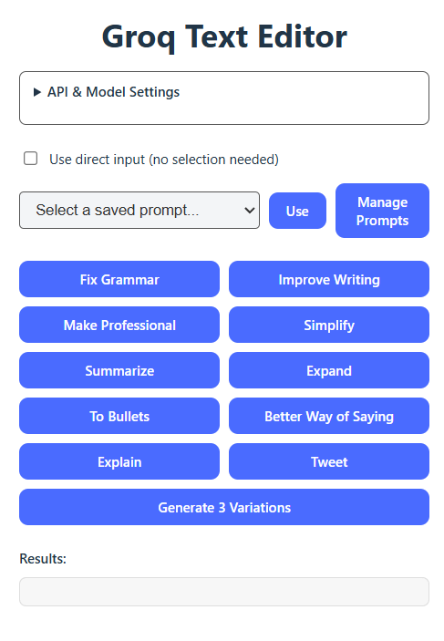

A small browser extension I use daily to clean up text as I type. This is a hobby project; I don't plan to monetize it.

## Features

- Fix typos in selected text or in the focused editable field (shortcut)
- Improve, summarize, simplify, expand, and more
- Direct input mode (no selection needed)
- Custom prompts (system or context)
- Multi-provider: Groq, OpenAI, and OpenAI-compatible local servers
- Auto-fetch model list when you save settings
- Shortcut runs the last action you used in the popup
- Optional auto-open popup and auto-copy results on shortcut
- Popup actions: Copy and Replace Selection

## Installation

### From Source

1. Clone this repository
2. Install dependencies:
   ```
   npm install
   ```
3. Build the extension:
   ```
   npm run build          # Chrome
   npm run build:firefox  # Firefox
   ```
4. Load the extension:
   - **Chrome**: `chrome://extensions/` -> enable Developer mode -> Load unpacked -> select `.output/chrome-mv3`
   - **Firefox**: `about:debugging#/runtime/this-firefox` -> Load Temporary Add-on... -> select any file in `.output/firefox-mv2`

## Usage

1. Open the extension popup
2. Choose a provider (Groq / OpenAI / OpenAI-compatible)
3. Set Base URL, API Key (if needed), and Model ID
4. Select text on a page or use direct input
5. Click an action or use the shortcut to fix typos inline

### Shortcut (inline fix)

Default: **Alt+Shift+G**

- If text is selected inside an editable field, only that selection is fixed
- If there is no selection, the entire field is fixed
- Change the shortcut at `chrome://extensions/shortcuts`
- The shortcut uses the last action you ran in the popup (e.g., Explain, Summarize)
- If an app blocks inline replace (common in WhatsApp), the result is copied so you can paste

### Popup actions

After any action finishes, the popup shows:

- **Copy**: copy the result to clipboard
- **Replace Selection**: replace the last selected editable field (when supported)

### Shortcut settings

You can opt out of:

- **Auto-open popup on shortcut**
- **Auto-copy results**

## Local Llama (Ollama)

Ollama is the quickest way to run local Llama models with an OpenAI-compatible API.

1. Install Ollama
   - macOS: `brew install ollama`
   - Other OS: use the installer at the Ollama website
2. Download a model:
   ```
   ollama run llama3.1
   ```
3. Make sure the server is running:
   ```
   ollama serve
   ```
4. In the extension settings:
   - Provider: **OpenAI-compatible (Local)**
   - Base URL: `http://localhost:11434`
   - Model: `llama3.1` (or the model you installed)
   - API Key: leave empty

You can also use LM Studio or any other OpenAI-compatible server. Set the Base URL to its local address (for LM Studio it is usually `http://localhost:1234`).

## Custom Prompts

1. Click **Manage Prompts**
2. Add a name and text for your prompt
3. Choose **system** or **context**
4. Save - it shows up in the dropdown

## Development

```
npm run dev          # Chrome
npm run dev:firefox  # Firefox
```

## Building for Distribution

```
npm run zip          # Chrome
npm run zip:firefox  # Firefox
```

## License

[MIT License](LICENSE)
